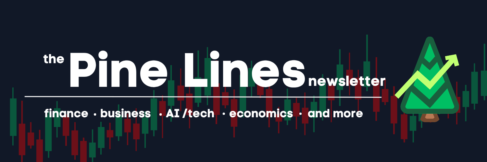

 

 

## What is Pine Lines?

One night I came across Pine Script while lying in bed, half-scrolling, half-bored. I started messing around with it just to see what it could do, and ended up hooked

That curiosity turned into Pine Lines: a newsletter where I break down Pine Script (+ Python) and TradingView for anyone else who thinks markets and code is a cool combination. No finance degree required, no gatekeeping, just clear explanations, real examples you can copy into the Pine Editor, and the occasional deep dive into whatever's happening in markets, business, and AI that week.

## 📬 Read the newsletter

Every issue lives on Substack:

**👉 [pinelines.substack.com](https://pinelines.substack.com)**

New issues cover:
- 🌲 Pine Script tutorials, line by line
- 📈 TradingView indicators and strategies
- 💵 "This Week in Finance" — markets, business, and economics commentary

## 📁 What's in this repo

This repo holds standalone, self-contained HTML versions of select Pine Lines issues — cleaned up, code-highlighted, and easy to read or reference outside of Substack.

| File | Issue |
|---|---|
| [`hello-world-in-pine-script.html`](./hello-world-in-pine-script.html) | "Hello, World" In Pine Script — the fundamentals: syntax, functions, data types, variables|
| [`indicators-in-pine-script.html`](./indicators-in-pine-script.html) | Indicators in Pine Script — trend/momentum/volatility indicators + a Stochastic Oscillator walkthrough |

Each file is a single HTML document — just open it in a browser, no build step or dependencies needed.

## 🌲 About

Pine Lines is written and maintained by **Sanhith Vandara**. If you're into Pine Script, trading, or just want to see someone learn this stuff in public, come hang out on [Substack](https://pinelines.substack.com).
